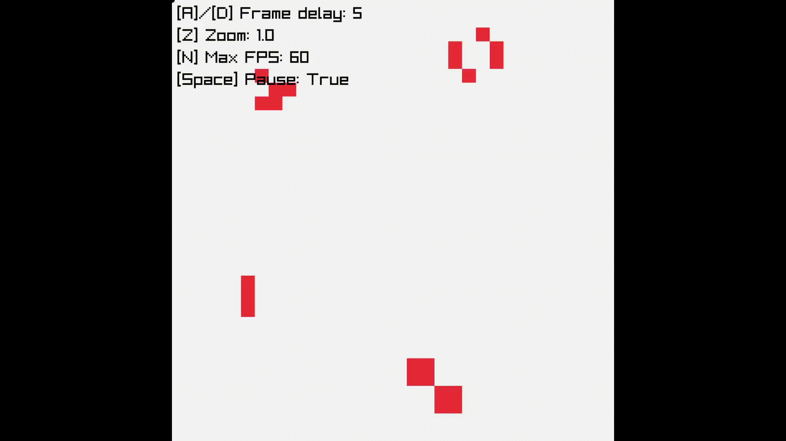

# Conway's Game of Life 

This is my own implementation of the famous [Conway's Game of Life](https://en.wikipedia.org/wiki/Conway%27s_Game_of_Life), a zero player game made by the British mathematician John Horton Conway. 

Intrestringly the entire game is turing complete, meaning that theoritcally you could make [a computer inside of it](https://www.youtube.com/watch?v=Kk2MH9O4pXY&t=1095s) and play a game of Conway's Game of Life inside of Conway's Game of Life.

I used Haskell with Raysan's [Raylib](https://www.raylib.com/) library.
